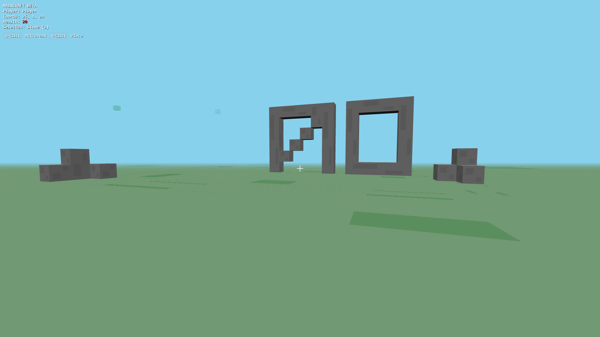

# 🧱 Maincraft

**Maincraft** is a Minecraft-inspired **persistent multiplayer voxel engine prototype**  
focused on **architecture, performance, and deterministic systems**.

---

## 📸 Screenshots

> In-game screenshots from the current development build

---

## 📌 Overview

Maincraft demonstrates a complete client–server voxel game architecture with:

- Server-authoritative logic
- Persistent world state
- Procedural terrain generation
- Real-time multiplayer synchronization

This project is built for learning, experimentation, and technical exploration.

---

## 🚀 Installation

Install dependencies:

    npm install

---

## 🧪 Development

Run the server in development mode:

    npx tsx src/server/main.ts

Client:

    http://localhost:3000

WebSocket:

    ws://localhost:8081

---

## 🏗️ Production Build & Run

Build the project:

    npx tsc

Run the production server:

    node dist/server/main.js

The production server provides:

- WebSocket API
- Static client hosting

Access:

    http://localhost:3000

---

## 🎮 Controls

- W / A / S / D — Move
- SPACE — Jump
- Left Click — Break Block / Attack
- Right Click — Place Block
- 1 / 2 / 3 — Select Block Type
- ESC — Release Mouse Lock

---

## 🏗️ Architecture

Server (src/server)  
Node.js WebSocket server handling all authoritative logic  
(physics, combat, persistence, validation)

World Generator (engine_py)  
Python-based procedural chunk generation via IPC

Client (client_render.html)  
Three.js WebGL renderer  
Stateless client that renders server state and sends input

---

## 🤝 Support the Project

If you find this project useful and would like to support its development:

| Currency | Wallet Address |
|--------|----------------|
| **Bitcoin (BTC)** | `bc1q3smxjtjesh3km3rl0y89nyg964esdjkkmtwyhm` |
| **Ethereum (ETH)** | `0x891c40D9ac520DC6c8827eDD744ee15c472e88Ff` |
| **USDT (TRC-20)** | `TJriJCkKnG8d6dh1tejmz79JtUvnNoRirc` |

Support is optional and greatly appreciated ❤️

---

## 📄 License

MIT License

---

Project repository:

    https://github.com/M4joux/Maincraft

